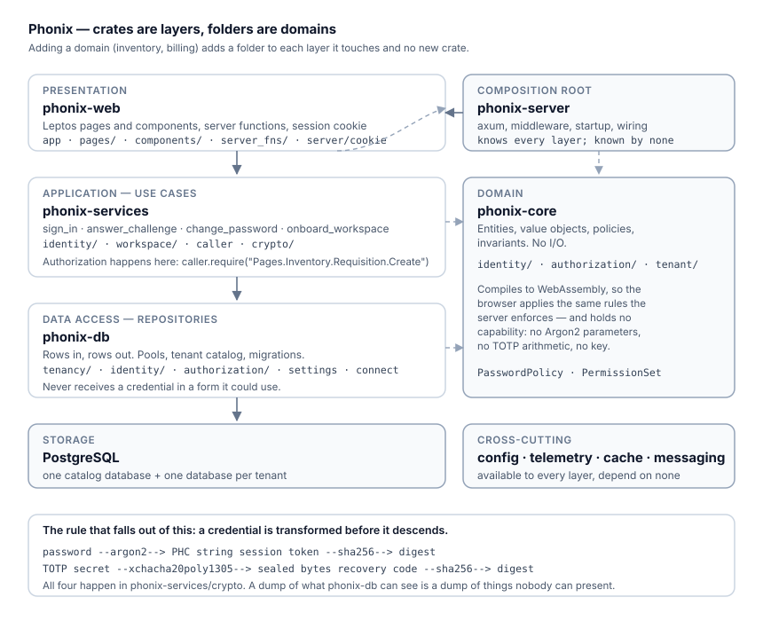

# phonix-config — configuration and its validation

A typed mirror of `config/*.toml`, layered and validated once at startup.



## Layering

```text
config/base.toml              committed, no secrets
  + config/<environment>.toml  committed, no secrets
  + PHONIX__* environment      secrets, from .env or the deployment
```

`PHONIX__DATABASE__PASSWORD` overrides `[database] password`. Secrets are typed
`secrecy::SecretString`, so a stray `{:?}` prints `[REDACTED]` rather than a
password.

## Fail fast, with a reason

`validate::check` runs before anything connects. A misconfigured process dies
immediately with a precise message rather than serving traffic and failing on
the first cache write or the hundredth tenant. In production it additionally
refuses to start when:

- any secret is empty, including the MFA encryption key
- `database.ssl_mode = "disable"`
- `tenancy.auto_provision = true` — any unrecognised host could create a database
- `tenancy.default_tenant` is set — a wrong host would serve another tenant's data
- `telemetry.tracing.log_bodies = true` — bodies routinely contain credentials
- the MFA key is the development one committed to `config/development.toml`

## Deployment settings vs organization settings

This crate holds what the **operator** decides — Argon2 cost, session lifetimes,
TOTP digits and step, the encryption key. What an **organization** decides —
minimum password length, whether MFA is required — lives in that workspace's
`workspace_settings` row.

The one place they meet is `[security.workspace_defaults]`, which seeds a new
workspace and is never consulted again. Changing it does not reach back into
workspaces that already exist, because their policy is theirs.

## How it connects

Everything depends on it; it depends only on `phonix-core` (to deserialise the
workspace-default policies straight into the shared domain types, so the TOML,
the stored row and the settings form cannot drift).
